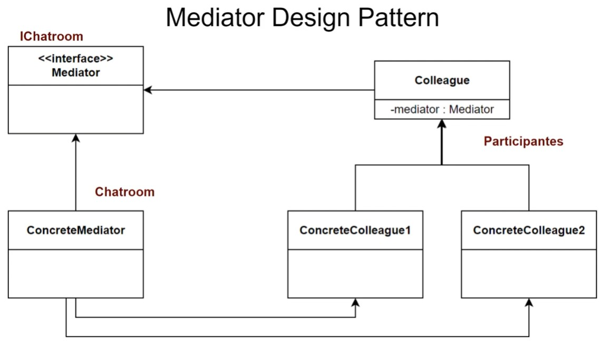

# Master Web Api ASP NET Core 9

## Web Api ASP NET Core 9

**Bienvenidos al implementación de Master en Web Apis con ASP NET Core**

En este implementación te ensenaremos las bases para construir una solucion Web Api multicapas,  usando las mejores practicas de desarrollo y una version didactica de Clean Architecture.

Trabajaremos con bases de datos relacionales SQL, conectadas con Entity Framework y su poderoso lenguaje de consultas Linq, asimismo implementaremos un modelo de seguridad, estos seran algunos de los temas que veremos en el curso:
- Desarrollo de solucion orientado a Web Api ASP NET Core 9
- Modelo multicapas basado en Clean Architecture
- Arquitectura basada en la comunicacion de mediatR y CQRS
- Consultas a base de datos usando Linq
- Reportes en Excel
- Upload de archivos onCloud con Web API ASP NET
- Mantenimiento de entidad principal usando modelos y sesion context de Entity Framework
- Modelamiento de proyecto usando tecnicas de 1,2 y 3 forma normal
- Implementacion de modelo de seguridad para login, registro de usuarios usando Identity Core
- Authorization basado en roles y policies/claims para asignar funcionalidades a usuarios
- Manejo avanzado de datos usando pagination

Y muchos temas mas...

## Que es una Web Api?

Una API es una interfaz de programación de aplicaciones (del inglés API: Application Programming Interface). Es un conjunto de rutinas que provee acceso a funciones de un determinado software.

Son publicadas por los constructores de software para permitir acceso a características de bajo nivel o propietarias, detallando solamente la forma en que cada rutina debe ser llevada a cabo y la funcionalidad que brinda, sin otorgar información acerca de cómo se lleva a cabo la tarea. Son utilizadas por los programadores para construir sus aplicaciones sin necesidad de volver a programar funciones ya hechas por otros, reutilizando código que se sabe que está probado y que funciona correctamente.

En la web, las API's son publicadas por sitios para brindar la posibilidad de realizar alguna acción o acceder a alguna característica o contenido que el sitio provee.

## O que você aprenderá:
- Web Apis con ASP NET 9
- Manejar Entity Framework Core con bases de datos
- Patron Mediator
- CQRS y Web Apis trabajando con Controllers
- Seguridad en ASP NET Web Apis
- Authenticacion y creacion de usuarios
- Authorization y manejo de Roles
- Reportes en Excel
- Upload de Imagenes en ASP NET Core

## Principios de Arquitectura

